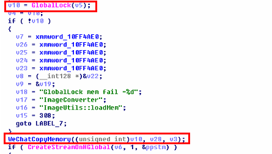
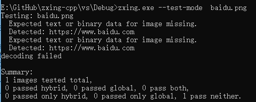

##### 说明


作者: JieKeH

帖子：[PC微信逆向 --- 分析获取登录二维码的数据](https://www.52pojie.cn/thread-924687-1-1.html)


##### 测试微信版本

PC微信核心模块：wechatwin.dll （2.6.7.57版本）

##### 步骤1、分析，Hook mars开启日志输出

Hook Mars框架的，开启日志输出。

```c++
typedef enum {
    kLevelAll = 0,
    kLevelVerbose = 0,
    kLevelDebug,    // Detailed information on the flow through the system.
    kLevelInfo,     // Interesting runtime events (startup/shutdown), should be conservative and keep to a minimum.
    kLevelWarn,     // Other runtime situations that are undesirable or unexpected, but not necessarily "wrong".
    kLevelError,    // Other runtime errors or unexpected conditions.
    kLevelFatal,    // Severe errors that cause premature termination.
    kLevelNone,     // Special level used to disable all log messages.
} TLogLevel;
```

```c++
std::string logPath = ""; //use your log path
std::string pubKey = ""; //use you pubkey for log encrypt

// init xlog
#if DEBUG
xlogger_SetLevel(kLevelDebug);
appender_set_console_log(true);
#else
xlogger_SetLevel(kLevelInfo);
appender_set_console_log(false);
#endif
appender_open(kAppednerAsync, logPath.c_str(), "Test", 0, pubKey.c_str());
```

从Mars的xlog源代码上来说就是设置了两个全局变量 gs_level和 sg_consolelog_open。

修改这两个变量达到目的。

##### 步骤2、分析log获取登录二维码逻辑




这里就是保存着二维码图片的内存地址和大小。

贴一个api说明,CreateStreamOnHGlobal函数从指定内存创建流对象。


函数原型：

```c++
WINOLEAPI CreateStreamOnHGlobal(
	HGLOBAL hGlobal, // Memory handle for the stream object
	BOOL fDeleteOnRelease, // Whether to free memory when the object is released
	LPSTREAM *ppstm // Address of output variable that receives the IStream interface pointer
);
```

hGlobal：由GlobalAlloc函数分配的内存句柄。

fDeleteOnRelease：该参数指明上一个参数制定的内存在该对象被释放后是否也自动释放。如果该参数设定为FALSE，那么调用者必须显式的释放hGlobal。如果该参数设置为TRUE，则hGlobal最终会自动释放。

ppstm：IStream指针的地址，该指针在该函数执行后指向新创建的流对象。该参数不能为NULL。

##### 源码使用

使用VS2015及以上版本release编译，复制生成的[Version.dll](./Bin/Version.dll)到微信安装目录。

##### libzxing

[libzxing](https://github.com/glassechidna/zxing-cpp)： 从图片读取二维码信息

[zxing.exe](./Bin/zxing.exe)




